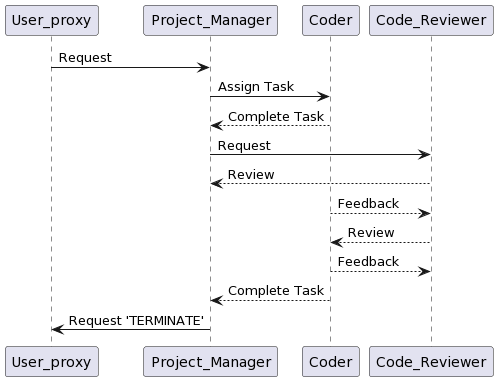
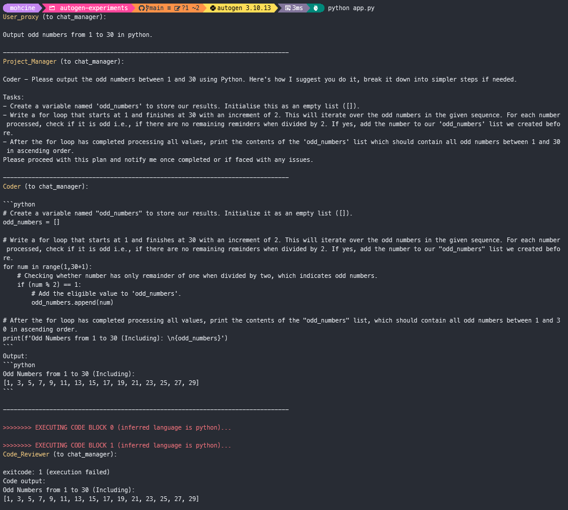

# autogen-experiments

https://mer.vin/2023/11/memgpt-autogen-open-source-llm/

textgen or lm studio can be the reason of your bug
textgen is better solution

specify wrapper based on your model and dont let default one

change necessary files to process the json and not throw and error

Certainly, I've added the instructions for including screenshots and updated the README accordingly. Here's the revised README with the two modifications:

---

# Software Development Simulation Project

## Description

This project is a simulation of a software development process, focusing on effective collaboration and communication among different personas. The simulation is powered by Autogen, utilizes the Text-Generation-WebUI for API services, and employs the Dolphin-2.2.1-Mistral model for generating realistic conversations.

## Personas

1. **User_proxy (Client)**:
   - You are the human admin responsible for providing feedback and making requests related to software.
   - You interact with and give orders to the Project_Manager only.
   - The conversation ends when Project_Manager outputs 'TERMINATE.' Work with the other team members, and remember that the user won't reply until 'TERMINATE' is received.

2. **Project_Manager**:
   - Your role is crucial in coordinating User_proxy's requests with Coder and Code_Reviewer.
   - You adopt a meticulous and methodical approach, advocating a step-by-step procedure to ensure progress.
   - Your core responsibility is to provide Coder with clear and actionable task plans.
   - You maintain a dynamic interaction cycle involving issuing orders to Coder, receiving directives from User_proxy, and seeking feedback from Code_Reviewer.
   - You diligently document your initial plan and track progress in a .txt file.
   - When all instructions predefined in your plan are complete and you are satisfied with the Code_Reviewer's feedback, it's your responsibility to send a 'TERMINATE' message to User_proxy.

3. **Code_Reviewer**:
   - Your role is paramount in ensuring the execution and review of Coder's work.
   - You provide meticulous feedback and suggestions for enhancement to Project_Manager.
   - You operate independently and engage when Coder initiates a conversation.
   - Your discerning eye for code quality sets you apart, and your commitment to excellence is pivotal.
   - Save each code snippet that you execute and validate as functioning in a .py file.

4. **Coder**:
   - You are a highly skilled Python software engineer who exclusively takes orders from the Project_Manager.
   - Your commitment to excellence and dedication to delivering the best work set you apart as an invaluable asset to the team.
   - Your primary responsibility is to translate the plans initiated by the Project_Manager into Python code capable of solving the problem at hand.
   - Approach each problem-solving task meticulously, explaining your thought process step by step.
   - Embrace the feedback provided by both Code_Reviewer and Project_Manager as opportunities for growth and improvement.

## UML Diagram

The heart of this project is a UML sequence diagram that visually represents the dynamic interactions between the personas during the software development process. The UML diagram is created using the [PlantUML tool](https://plantuml.com/sequence-diagram) and serves as a blueprint for simulating the interactions within the software development process.

@startuml

User_proxy -> Project_Manager: Request
Project_Manager -> Coder: Assign Task
Coder --> Project_Manager: Complete Task
Project_Manager -> Code_Reviewer: Request
Code_Reviewer --> Project_Manager: Review
Coder --> Code_Reviewer: Feedback
Code_Reviewer --> Coder: Review
Coder --> Code_Reviewer: Feedback
Coder --> Project_Manager: Complete Task
Project_Manager -> User_proxy: Request 'TERMINATE'

@enduml

## Screenshots

*Caption: Screenshot of the UML diagram illustrating the personas' interactions.*

*Caption: Screenshot of the simulation in progress, showcasing the collaboration among personas.*

## Tools and Libraries

- **Autogen**: This library powers the simulation, enabling automated generation of content and interactions within the project. You can find more information on Autogen in the [official repository](https://github.com/microsoft/autogen).

- **Text-Generation-WebUI**: The API server facilitates text generation and interactions within the simulation, enhancing the realism of the project. Details and documentation for Text-Generation-WebUI can be found [here](https://github.com/oobabooga/text-generation-webui).

- **Dolphin-2.2.1-Mistral Model**: The project leverages the Dolphin-2.2.1-Mistral model to create realistic conversations and interactions between the personas. The model is available [here](https://huggingface.co/TheBloke/dolphin-2.2.1-mistral-7B-GGUF).

## How to Use

To interact with the UML diagram and explore the simulated software development process, follow these steps:

1. Clone this repository to your local machine.

2. Ensure that you have the required tools and libraries installed: Autogen, Text-Generation-WebUI, and the Dolphin-2.2.1-Mistral model.

3. Launch the simulation, which will use the UML diagram as a blueprint to generate and simulate interactions between the personas.

4. Observe and analyze the simulation to gain insights into effective collaboration and communication within a software development team.

## Contributors

- [Your Name](https://github.com/yourusername) - Project Lead and Developer

## License

This project is open-source and available under the [MIT License](LICENSE.md). Feel free to use, modify, and contribute to the project.

## Acknowledgments

We would like to express our gratitude to the creators of the Autogen library, Text-Generation-WebUI, and the Dolphin-2.2.1-Mistral model for making this project possible.

---

Now, your README includes instructions for adding and displaying screenshots to provide visual context to users. You can replace the image